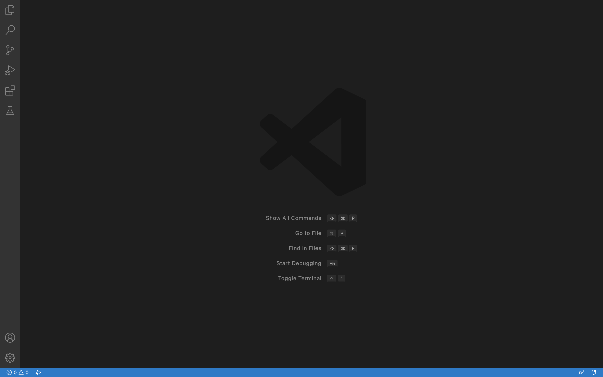
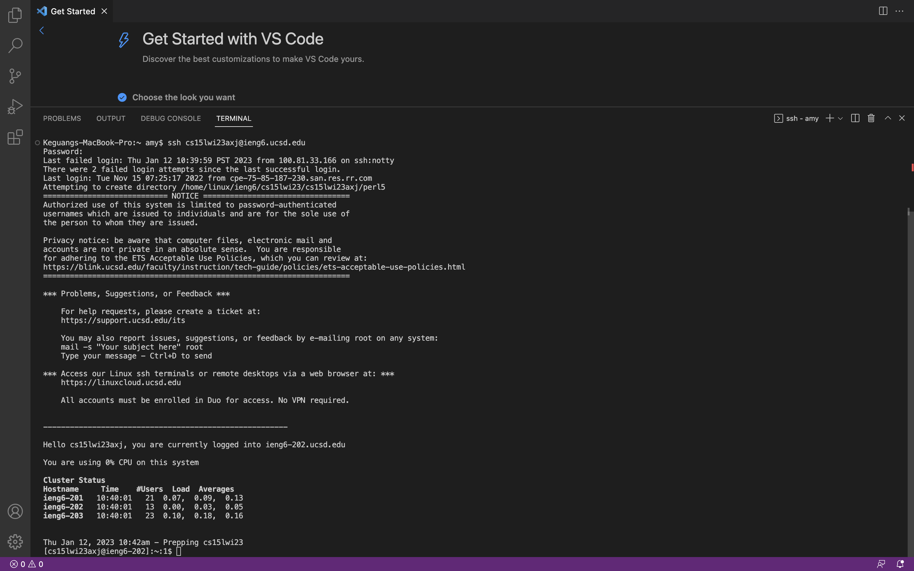
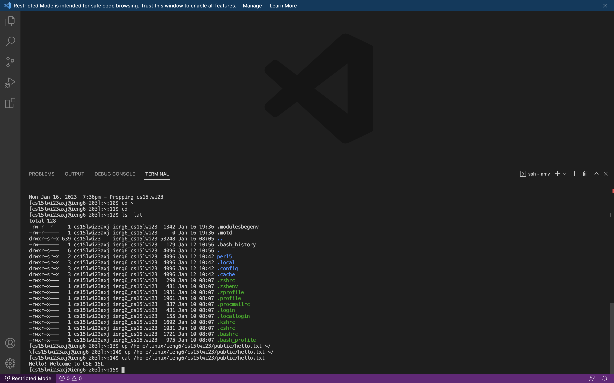
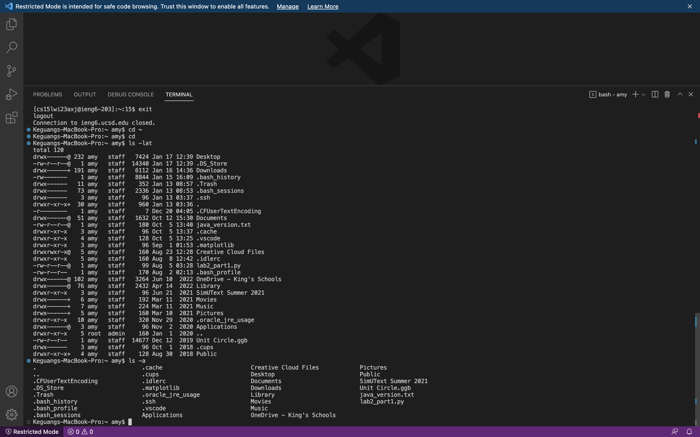

# How to Log into a Course-specific Account on ieng6?

**Part 1: Installing VScode**\
I went to the Visual Studio Code website([Link](https://code.visualstudio.com)) and downloaded it to my computer.
I saw the picture below when I opened the downloaded Visual Studio Code.

**Part 2: Remotely Connecting**\
I opened a terminal on VScode and typed in the command line:$ ssh UserNameofCourseSpecificAccount@ieng6.ucsd.edu
It asked for the password of my account. I put in my password, and I thus successfully connected to the remote server. The whole process looked like this:

To log out of the remote server, I typed in the command $ exit

**Part 3: Trying Some Commands**
- I tried some commands while logged in the remote server:

- I also tried some commands after logging out of the remote server:

