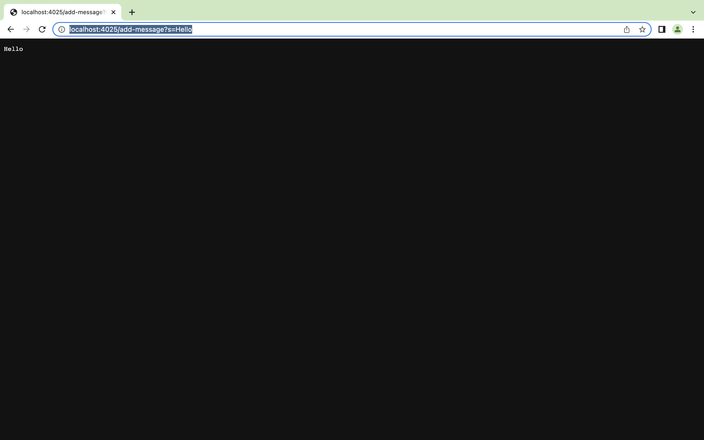
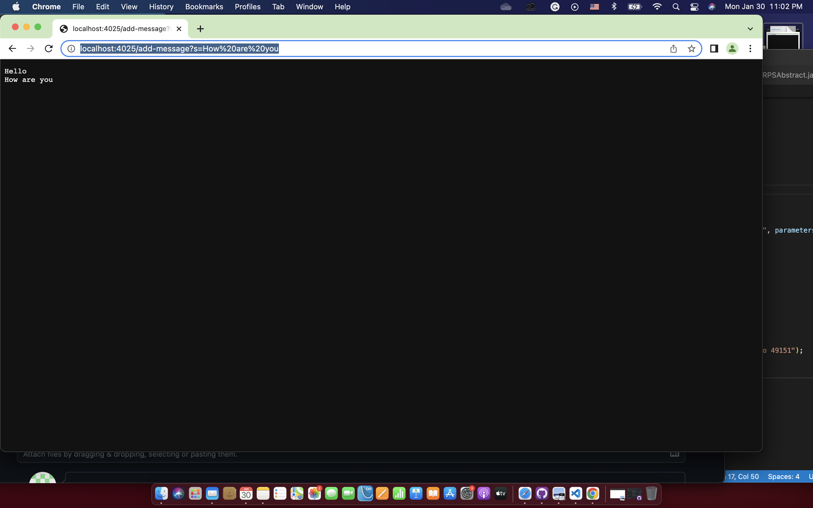

# Lab Report 2: Web Server and Debugging

**Part 1: Web Server

I created a web server that can take in a request of string and show the string along with the previous strings on the web pages.
The requests look like this: /add-message?s=<string>, and the <string> will be displayed on the web pages.

Here is my code:
  
  import java.io.IOException;
  import java.net.URI;
  
  class Handler implements URLHandler{
      String previousMessage = "";
  
      public String handleRequest(URI url) {
    
          if (url.getPath().contains("/add-message")) {
              String []strings = url.getQuery().split("=");
              if (strings[0].equals("s")) {
                  String message = strings[1] + "\n";
                  this.previousMessage = previousMessage.concat(message);
                  return previousMessage;
              }
            
          }
          return "404 Not Found!";
      }
  }
  
  class StringServer {
      
      public static void main(String[] args) throws IOException {
          
          if(args.length == 0){
              System.out.println("Missing port number! Try any number between 1024 to 49151");
              return;
          }

          int port = Integer.parseInt(args[0]);

          Server.start(port, new Handler());
      }
  }
  
  
Notes: The interface URLHandler is already impemented in the wavelet repository that we were asked to forked in lab 2. The code of the class StringServer is copied from the class NumberServer in the wavelet repository.
  
  
I started the server, and I first tried to let the string "Hello" be displayed on the page:

To display the string, the handleRequest and the main method in the NumberServer class were called.
For the handleRequest method, the relevant argument is url which holds the value of http://localhost:4025/add-message?s=Hello. For the main method the relevant argument is the port number which is 4025 in this case.
  
I then changed the string into "how are you", and both "Hello" and "how are you" were displayed on the page:

To display the string, the handleRequest and the main method in the NumberServer class were called.
For the handleRequest method, the relevant argument is url which holds the value of http://localhost:4025/add-message?s=How%20are%20you (I typed in http://localhost:4025/add-message?s=How are you) . For the main method the relevant argument is the port number which is still 4025 in this case.
  
  
**Part 2: Debugging
We encountered many bugs in lab 3, and one of them was this reversed method that tried to return a new array that has all the elements in the parameter in reversed order:

  static int[] reversed(int[] arr) {
      int[] newArray = new int[arr.length];
      for(int i = 0; i < arr.length; i += 1) {
        arr[i] = newArray[arr.length - i - 1];
      }
      return arr;
  }

              
                                    
I implemented a JUnit test with failure inducing input:
@Test
public void testReversed2() {
    int[] input = {1, 2, 3, 4, 5, 6, 7};
    assertArrayEquals(new int[] {7, 6, 5, 4, 3, 2, 1}, 
            ArrayExamples.reversed(input));
}
                                    
Here is a JUnit test  with input that does not induce a failure:
@Test
public void testReversed3() {
    int[] input = {0};
    assertArrayEquals(new int[] {0}, 
            ArrayExamples.reversed(input));
}

Here is the symptom from running the JUit tests above:
![Image] (unittest.png)
