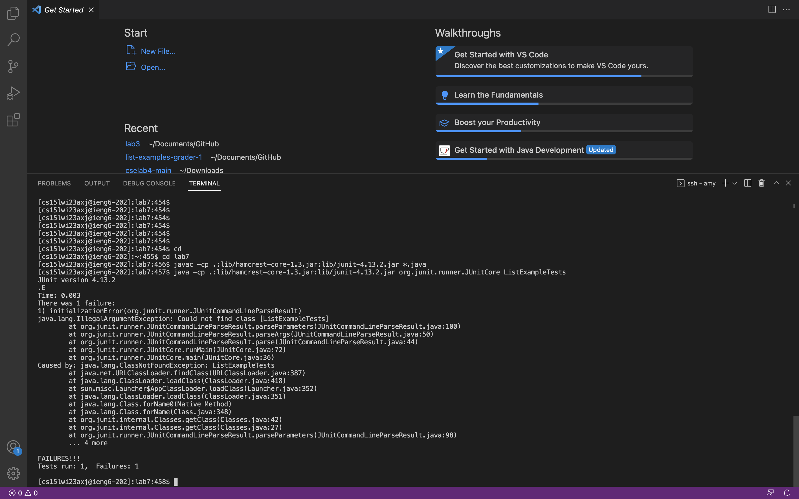

# Lab Report 4

**Step 4: log into ieng6**\

For this step, since the command to log into the account was already in my history, I typed `Ctrl-R` and then typed `ssh` to get the whole command with my ieng6 account from the history. I then entered `<enter>`. It directly logged into the ieng6 account without asking for my password because I had generated SSH keys before this.

**Step 5: clone the fork of the repository from Gitnub account**\

I copied the SSH link from the my fork of the repository on Github. On the terminal, I typed `git clone <link>`. To paste the link, I did `Ctrl-V`. The repository was successfullly cloned to the ieng6 remote server. 

**Step 6: run the tests, demonstrating that they fail**\

I first typed `cd lab7` to change my directory into lib7 directory.\ 
To compile ListExample.java and ListExampleTests.java files, I typed `Ctrl-R` to get access to my commmand history. I then typed `javac`, and I found the command for compiling, which was `javac -cp .:lib/hamcrest-core-1.3.jar:lib/junit-4.13.2.jar *.java`. I then pressed `<enter>`, and the files was successfully compiled.\
To run the files, I typed `Ctrl-R` to get access to my commmand history. I then typed `lib`, and I found the command for compiling, which was `java -cp .:lib/hamcrest-core-1.3.jar:lib/junit-4.13.2.jar org.junit.runner.JUnitCore ListExamplesTests`. I then pressed `<enter>`, and the files was successfully runned. It showed that one it failed on one test.
  
**Step 7: Edit the code file to fix the failing test**\

Edit the code file to fix the failing test
Run the tests, demonstrating that they now succeed
Commit and push the resulting change to your Github account (you can pick any commit message!)

